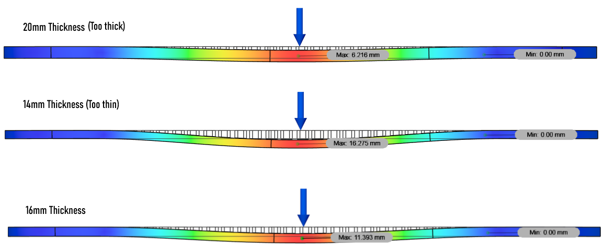

# Project Description

This project delved into the innovative realm of skateboard design, employing generative design for skateboard trucks and stress testing for a longboard deck. The project also emphasized the application of Selective Laser Sintering (SLS) printing, a cutting-edge additive manufacturing technique.

Generative design is a 3D modeling approach that utilizes algorithms to iteratively generate design alternatives based on specified constraints and goals. In the context of skateboard trucks, this method allowed for the creation of optimized structures by exploring numerous possibilities, ultimately resulting in a design that meets the strength requirements for each part while minimizing material usage. The algorithm-driven process considers factors such as load distribution, stress points, and material properties to produce a highly efficient and lightweight design.

Stress testing, on the other hand, involves subjecting a structure to simulated loads to assess its performance and durability. In this skateboard project, stress testing was crucial to validate the generatively designed skateboard trucks as well as the integrity of the deck under the weight of a rider. By applying various loads and analyzing the resulting stresses, I ensured that the trucks and deck could withstand the forces exerted during skateboarding maneuvers while also minimizing the amount of printed material.

# SLS Printing and Generative Design Synergy

Selective Laser Sintering (SLS) is an additive manufacturing technique that uses a laser to selectively fuse powdered materials, layer by layer, to create a three-dimensional object. SLS printing is particularly well-suited for generative design as it allows for the fabrication of complex geometries with high precision. The layer-by-layer construction aligns seamlessly with the intricate structures generated through the generative design process.

The synergy between SLS printing and generative design lies in the ability to manufacture lightweight and structurally optimized components. SLS printers can produce intricate geometries that may be challenging or impossible to achieve using traditional manufacturing methods. This aligns perfectly with the outcomes of generative design, resulting in efficient and high-performing components while minimizing material waste.

In the automotive sector, these technologies can revolutionize the design and manufacturing of vehicle components. Generative design can be employed to create lightweight and durable parts, optimizing fuel efficiency and overall performance. SLS printing further enhances the feasibility of producing these complex designs, enabling rapid prototyping and cost-effective production of customized components. From engine components to chassis structures, the combination of generative design and SLS printing holds immense potential for the automotive industry.

In the aerospace industry, where weight reduction is critical for fuel efficiency and flight performance, the integration of generative design and SLS printing can be transformative. Aircraft components can be designed with intricate internal structures that maintain strength while minimizing weight. SLS printing allows for the fabrication of these complex designs using lightweight materials, contributing to the overall weight reduction of the aircraft. This synergy can lead to more fuel-efficient and environmentally sustainable air travel.

# Aluminum Truck CAD Model
<iframe src="https://vanderbilt643.autodesk360.com/shares/public/SH512d4QTec90decfa6e0bac353a878b98e9?mode=embed" width="640" height="480" allowfullscreen="true" webkitallowfullscreen="true" mozallowfullscreen="true"  frameborder="0"></iframe>

# Nylon Truck CAD Model
<iframe src="https://vanderbilt643.autodesk360.com/shares/public/SH512d4QTec90decfa6ee664d8b6d80d3b05?mode=embed" width="640" height="480" allowfullscreen="true" webkitallowfullscreen="true" mozallowfullscreen="true"  frameborder="0"></iframe>

# Deck Design Rationale
Since strength was the main concern for this deck, I chose a honeycomb pattern for my board design. Due to the nature of honeycomb wherein each hexagonal wall is supported by other walls, this pattern provides astonishing compressive strength that will help my board withstand impact forces while riding. On top of this, it looks cooler than the rectangular and circular patterns I tested beforehand. I added parameters for the wall thickness in between each hexagon, as well as the overall thickness of the board for easy adjusting. I then ran a load simulation with a 200-pound rider placed at the center of the board and observed the deflection of the plastic. Too much deflection and the board might snap, and too little deflection can hinder turning and comfort while riding. I was aiming for a deflection of about 12mm, so I readjusted my board's thickness and resimulated the load until this deflection was met. After tweaking the parameters and re-simulating the load three times (shown below), I came to a final board thickness of 16mm. 

# Skateboard Deck CAD Model
<iframe src="https://vanderbilt643.autodesk360.com/shares/public/SH512d4QTec90decfa6ec35f1f6949e1685b?mode=embed" width="640" height="480" allowfullscreen="true" webkitallowfullscreen="true" mozallowfullscreen="true"  frameborder="0"></iframe>

# Assembled Skateboard CAD Model
<iframe src="https://vanderbilt643.autodesk360.com/shares/public/SH512d4QTec90decfa6eb96048b8f4238fc3?mode=embed" width="640" height="480" allowfullscreen="true" webkitallowfullscreen="true" mozallowfullscreen="true"  frameborder="0"></iframe>

# Conclusion

In conclusion, the amalgamation of generative design, stress testing, and SLS printing in the skateboard project exemplifies the innovative strides that can be made in product design and manufacturing. The efficient, lightweight, and structurally optimized components created through these methods have direct applications in industries such as automotive and aerospace. As a computer engineering student, this project provided valuable insights into the practical implementation of cutting-edge technologies, paving the way for future advancements in engineering and manufacturing.

## Gallery


